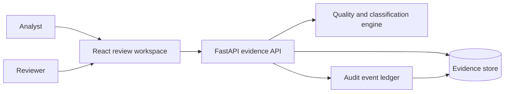
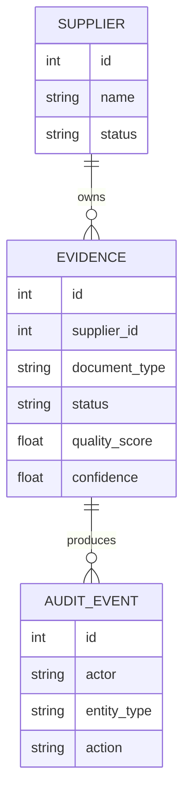
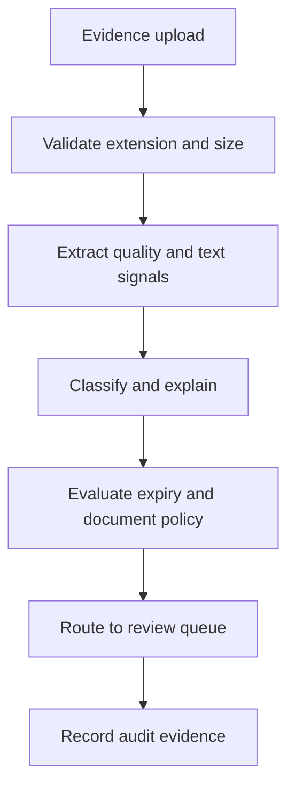
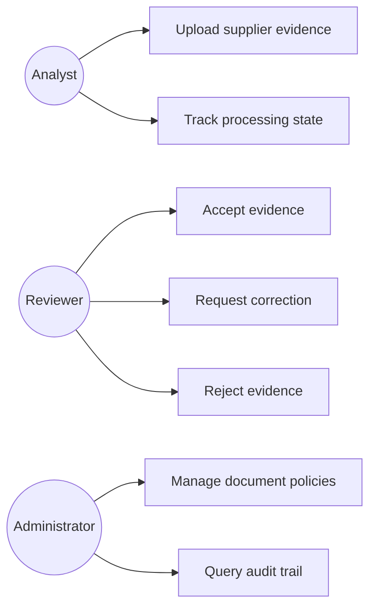
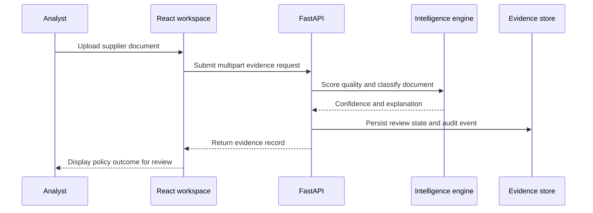

# Supplier Document Intelligence and Compliance Evidence Platform

## The Problem

Supplier due diligence frequently depends on certificates, tax records, insurance documents, and screening evidence scattered through email and shared folders. Teams must decide whether each document is current, legible, correctly classified, and reviewed by the right person. This creates avoidable delays, inconsistent control application, and weak evidence trails when procurement or compliance teams need to explain a supplier decision.

## The Solution

This platform manages the supplier evidence lifecycle from secure intake to reviewer decision. Analysts upload permitted PDF and image evidence with an assigned policy type. The FastAPI service checks file size and extension, measures image quality, classifies document text with confidence and explanation output, evaluates expiry and policy conditions, and routes records to a controlled review queue. Administrators and reviewers accept, request correction, or reject eligible evidence while the system creates audit events for upload, processing, and decision actions.

## Live Demo and Tech Stack

| Layer | Implementation |
|---|---|
| Evidence API | Python 3.12, FastAPI, Pydantic, multipart upload validation, WebSocket status endpoint |
| Intelligence | Pillow, NumPy, deterministic quality scoring, explainable keyword based document classification contract |
| Data and audit | SQLite development persistence, portable SQL migration, indexed evidence and audit event records |
| Review interface | React 19, TypeScript, Vite, TanStack React Query, Zustand, responsive CSS |
| Roles | `admin`, `analyst`, and `reviewer` with endpoint enforcement |
| Delivery | Docker Compose, GitHub Actions, pytest, TypeScript and Vite build checks |

The development web interface runs on port `10210` and binds to `0.0.0.0`. The API runs on port `8100` and also binds to `0.0.0.0` when started with the provided command.

## Local Setup and Run Instructions

```bash
git clone https://github.com/kholipha-ahmmad-al-amin/python-supplier-document-intelligence-compliance-platform.git
cd python-supplier-document-intelligence-compliance-platform

python3 -m venv .venv
. .venv/bin/activate
pip install -r backend/requirements.txt
cd backend
uvicorn app.main:app --host 0.0.0.0 --port 8100
```

Open a second terminal for the review workspace.

```bash
cd python-supplier-document-intelligence-compliance-platform/frontend
pnpm install
pnpm dev
```

For container based local development, run `docker compose up --build`. Use `X-Role` and `X-Actor` request headers when calling the API directly. The accepted role values are `admin`, `analyst`, and `reviewer`.

## System Documentation (Mermaid.js)

### Architecture Diagram



### ERD Diagram



### Data Flow Diagram



### Use Case Diagram



### Sequence Diagram



## Owner

Created and maintained by Kholipha Ahmmad Al-Amin.

Software Engineer and AI Specialist

Founder and CEO of EquiSaaS BD

Principal Consultant at AR IT Consultancy

Full Stack Developer and SaaS Product Builder

### Official links

Portfolio: https://kholipha-ahmmad-al-amin.equisaas-bd.com/

GitHub: https://github.com/kholipha-ahmmad-al-amin

LinkedIn: https://www.linkedin.com/in/kholipha-ahmmad-al-amin

X: https://x.com/al_amin5519

Facebook: https://www.facebook.com/kholipha.ahmmad.al.amin

Instagram: https://www.instagram.com/kholipha.ahmmad.al.amin

## Ownership

This project was created and is maintained by Kholipha Ahmmad Al-Amin.
